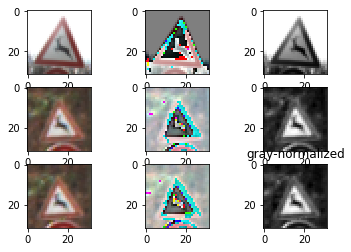
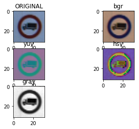
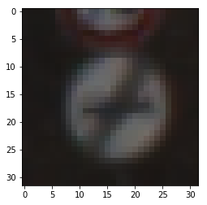
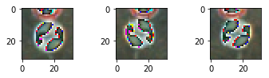
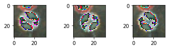
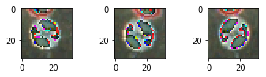
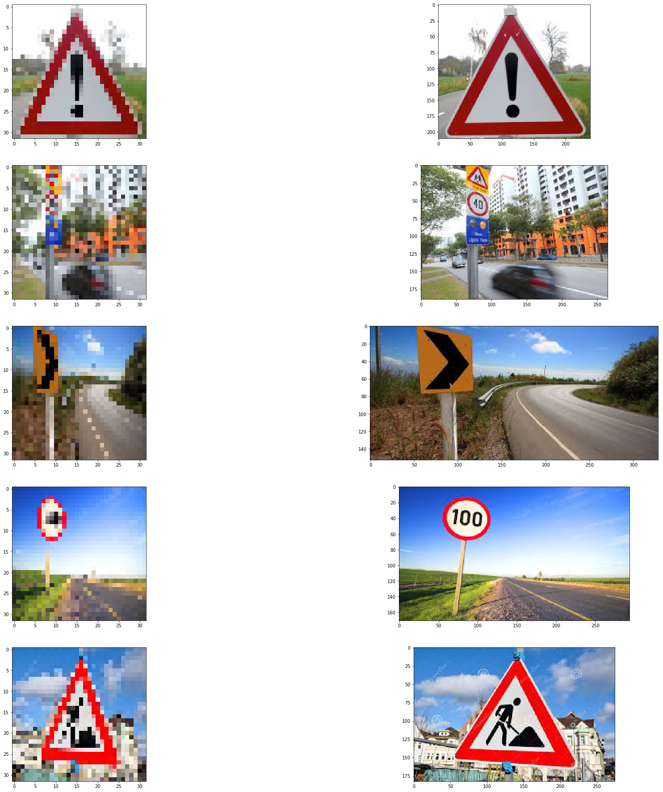
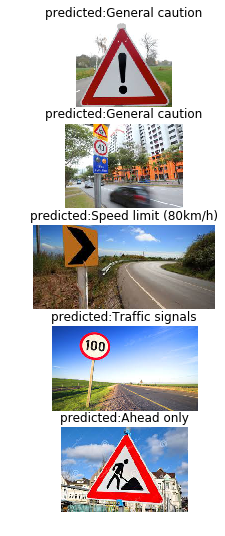

# Self-Driving Car Engineer Nanodegree

## Deep Learning

## Project: Build a Traffic Sign Recognition Classifier

ipython notebbok file is :- Traffic_Sign_Classifier.ipynb

## Step 1: Dataset Summary & Exploration

The pickled data is a dictionary with 4 key/value pairs:

- `'features'` is a 4D array containing raw pixel data of the traffic sign images, (num examples, width, height, channels).
- `'labels'` is a 1D array containing the label/class id of the traffic sign. The file `signnames.csv` contains id -> name mappings for each id.
- `'sizes'` is a list containing tuples, (width, height) representing the the original width and height the image.
- `'coords'` is a list containing tuples, (x1, y1, x2, y2) representing coordinates of a bounding box around the sign in the image. **THESE COORDINATES ASSUME THE ORIGINAL IMAGE. THE PICKLED DATA CONTAINS RESIZED VERSIONS (32 by 32) OF THESE IMAGES**

Complete the basic data summary below. Use python, numpy and/or pandas methods to calculate the data summary rather than hard coding the results. For example, the [pandas shape method](http://pandas.pydata.org/pandas-docs/stable/generated/pandas.DataFrame.shape.html) might be useful for calculating some of the summary results. 

### Provide a Basic Summary of the Data Set Using Python, Numpy and/or Pandas


    Number of training examples = 34799
    Number of testing examples = 12630
    Image data shape = (32, 32, 3)
    Number of classes = 43


----

## Step 2: Design and Test a Model Architecture

Design and implement a deep learning model that learns to recognize traffic signs. Train and test your model on the [German Traffic Sign Dataset](http://benchmark.ini.rub.de/?section=gtsrb&subsection=dataset).

There are various aspects to consider when thinking about this problem:

- Neural network architecture
- Play around preprocessing techniques (normalization, rgb to grayscale, etc)
- Number of examples per label (some have more than others).
- Generate fake data.

Here is an example of a [published baseline model on this problem](http://yann.lecun.com/exdb/publis/pdf/sermanet-ijcnn-11.pdf). It's not required to be familiar with the approach used in the paper but, it's good practice to try to read papers like these.

**NOTE:** The LeNet-5 implementation shown in the [classroom](https://classroom.udacity.com/nanodegrees/nd013/parts/fbf77062-5703-404e-b60c-95b78b2f3f9e/modules/6df7ae49-c61c-4bb2-a23e-6527e69209ec/lessons/601ae704-1035-4287-8b11-e2c2716217ad/concepts/d4aca031-508f-4e0b-b493-e7b706120f81) at the end of the CNN lesson is a solid starting point. You'll have to change the number of classes and possibly the preprocessing, but aside from that it's plug and play!

### Pre-process the Data Set (normalization, grayscale, etc.)


##### https://www.quora.com/What-are-some-ways-of-pre-procesing-images-before-applying-convolutional-neural-networks-for-the-task-of-image-classification
#### https://stats.stackexchange.com/questions/185853/why-do-we-need-to-normalize-the-images-before-we-put-them-into-cnn
##### https://stats.stackexchange.com/questions/211436/why-do-we-normalize-images-by-subtracting-the-datasets-image-mean-and-not-the-c
better way from research paper:-
The first pass, you will compute the mean pixel values of each channel, and the variance over the entire set of pixels in a channel. When you are finished, you should have 3075 values: one mean value per pixel per channel (32*32*3=3072), and one variance per channel (3).

On the second pass you will modify the images by taking the subtracting from each pixel the mean you found in the first pass, and dividing by the standard deviation from the first pass.

Let μr,i,jμr,i,j be the mean value of the red channel at the i,ji,j-th pixel, and let σ2rσr2 be the variance of the red channel over all pixels in all images. Then the new value corresponding to the red channel of the i,ji,j-th pixel in the kk-th image ri,j,kri,j,k becomes




### Data visulization in different form for few training data





    <matplotlib.image.AxesImage at 0x7f6b049740b8>





### We tried keras image Augmentation 

We have used keras image Augmentation generator and used to train mode with as well as with image Generator. Image generator helped in generating more data using simple transforation like roation, normaization and scaling


```python
# define data preparation using augmentation
datagen = ImageDataGenerator(featurewise_center=True,
    featurewise_std_normalization=True,
    rotation_range=20,
    width_shift_range=0,
    height_shift_range=0,
    horizontal_flip=True )


#datagen = ImageDataGenerator(rotation_range=90)
# fit parameters from data
datagen.fit(X_train.astype('float32'))
```











### Model Architecture

We have used a simple model architecture added 2 layer convolution after that flatten layer then finally to dense layer with softmax layer  to output characteristics. Added drop out to avoid overfitting . We got accuracy with validation data set and if still model hadn't get good accuracy we then have tried Reguralizatin . But we wrere lucky with this architecture. 

    _________________________________________________________________
    Layer (type)                 Output Shape              Param #   
    =================================================================
    conv2d_7 (Conv2D)            (None, 25, 25, 64)        12352     
    _________________________________________________________________
    activation_13 (Activation)   (None, 25, 25, 64)        0         
    _________________________________________________________________
    average_pooling2d_7 (Average (None, 12, 12, 64)        0         
    _________________________________________________________________
    conv2d_8 (Conv2D)            (None, 5, 5, 64)          262208    
    _________________________________________________________________
    activation_14 (Activation)   (None, 5, 5, 64)          0         
    _________________________________________________________________
    average_pooling2d_8 (Average (None, 2, 2, 64)          0         
    _________________________________________________________________
    flatten_4 (Flatten)          (None, 256)               0         
    _________________________________________________________________
    dense_7 (Dense)              (None, 500)               128500    
    _________________________________________________________________
    dropout_4 (Dropout)          (None, 500)               0         
    _________________________________________________________________
    activation_15 (Activation)   (None, 500)               0         
    _________________________________________________________________
    dense_8 (Dense)              (None, 43)                21543     
    _________________________________________________________________
    activation_16 (Activation)   (None, 43)                0         
    =================================================================
    Total params: 424,603
    Trainable params: 424,603
    Non-trainable params: 0
    _________________________________________________________________


### Model Training
I have used a batch size of 2000 images. and epoch of 100. 
Earlier i am using single batch size so model was taking more time to train so i added batch of images in model fit function. Also i tried model training with Keras generator function which is also added more images in traing data  after image augmentation but  we have sufficient image data set of around 32000 images so it doesn't matter much in this case .  I haven't added Regurlarization im model.fit call as model is easily able to converge to good accuracy on validation data set after 20 epochs.

### Model Optimiser
i have used ADAM optimiser.

```python
model.compile(optimizer='adam', loss='categorical_crossentropy', metrics=['accuracy'])
```

I have used adam optimiser due to folowing reason:-
Adam is different to classical stochastic gradient descent.

Stochastic gradient descent maintains a single learning rate (termed alpha) for all weight updates and the learning rate does not change during training.
Adam realizes the benefits of both AdaGrad and RMSProp.

Instead of adapting the parameter learning rates based on the average first moment (the mean) as in RMSProp, Adam also makes use of the average of the second moments of the gradients (the uncentered variance).

Specifically, the algorithm calculates an exponential moving average of the gradient and the squared gradient, and the parameters beta1 and beta2 control the decay rates of these moving averages.


https://machinelearningmastery.com/adam-optimization-algorithm-for-deep-learning/

### Model Preformance
    Not using data augmentation.


    Epoch 100/100
    7s - loss: 0.0088 - acc: 0.9976 - val_loss: 0.3562 - val_acc: 0.9399


    acc: 91.49%
    Saved model to disk
    Loaded model from disk


---

## Step 3: Test a Model on New Images

To give yourself more insight into how your model is working, download at least five pictures of German traffic signs from the web and use your model to predict the traffic sign type.

You may find `signnames.csv` useful as it contains mappings from the class id (integer) to the actual sign name.

### Load and Output the Images

We downloaded below images from internet . Left side shows resize image (32,32,3) and original images were dispalyed on the right side.
Downloaded images have different size so we need to call resize over these images. I am still exploring if we can build  model using batch input size param in keras first layer and can we give different size images whose final shape after calling numpy reshape will match to keras first layer shape.





### Predict the Sign Type for Each Image


Model hadn't performed well on these downloded images . these images are not aavailable in original dataset. main reason could be due to pixilation after resize of these downloaded images.  As shown the original images and resize images. Model had good accuracyon training and validation data set.





Model doesn't perform well on new images that were not in training and test image dataset. It predicted correctely only one out of 5 images. Internet images were of bigger sizes than model input size so i have resized these images which causes little bit pixilation. One reason for low accurracy on these new images could as sateted above. future improvement ould be made to make model to independednt of image input size . 

---

## Step 4: Visualize the Neural Network's State with Test Images

 This Section is not required to complete but acts as an additional excersise for understaning the output of a neural network's weights. While neural networks can be a great learning device they are often referred to as a black box. We can understand what the weights of a neural network look like better by plotting their feature maps. After successfully training your neural network you can see what it's feature maps look like by plotting the output of the network's weight layers in response to a test stimuli image. From these plotted feature maps, it's possible to see what characteristics of an image the network finds interesting. For a sign, maybe the inner network feature maps react with high activation to the sign's boundary outline or to the contrast in the sign's painted symbol.

 Provided for you below is the function code that allows you to get the visualization output of any tensorflow weight layer you want. The inputs to the function should be a stimuli image, one used during training or a new one you provided, and then the tensorflow variable name that represents the layer's state during the training process, for instance if you wanted to see what the [LeNet lab's](https://classroom.udacity.com/nanodegrees/nd013/parts/fbf77062-5703-404e-b60c-95b78b2f3f9e/modules/6df7ae49-c61c-4bb2-a23e-6527e69209ec/lessons/601ae704-1035-4287-8b11-e2c2716217ad/concepts/d4aca031-508f-4e0b-b493-e7b706120f81) feature maps looked like for it's second convolutional layer you could enter conv2 as the tf_activation variable.

For an example of what feature map outputs look like, check out NVIDIA's results in their paper [End-to-End Deep Learning for Self-Driving Cars](https://devblogs.nvidia.com/parallelforall/deep-learning-self-driving-cars/) in the section Visualization of internal CNN State. NVIDIA was able to show that their network's inner weights had high activations to road boundary lines by comparing feature maps from an image with a clear path to one without. Try experimenting with a similar test to show that your trained network's weights are looking for interesting features, whether it's looking at differences in feature maps from images with or without a sign, or even what feature maps look like in a trained network vs a completely untrained one on the same sign image.

<figure>
 
 <figcaption>
 <p></p> 
 <p style="text-align: center;"> Your output should look something like this (above)</p> 
 </figcaption>
</figure>
 <p></p> 


### Question 9

Discuss how you used the visual output of your trained network's feature maps to show that it had learned to look for interesting characteristics in traffic sign images


I don't know how to visualize middle layers in keras . If model architecture is build with raw tensor flow fuctions then the approach explained in lectures to  visualize the intermideate layer can be used. As per transfer learning lectures we can remove last few layers and then backtrack to see model output of individual layers.
